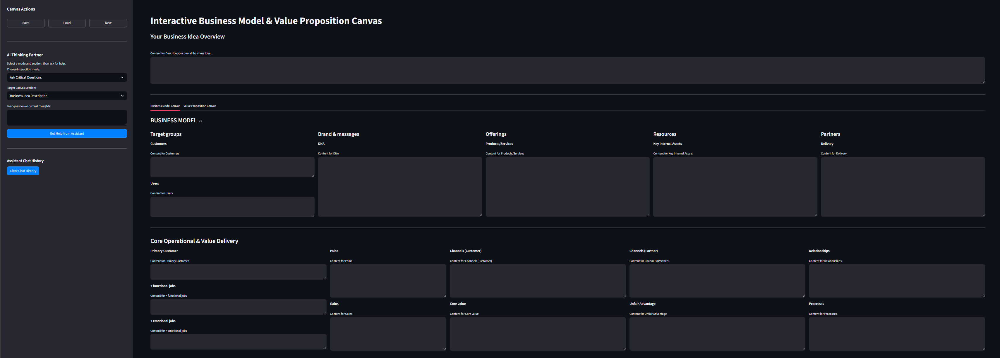

# Interactive Business Model & Value Proposition Canvas with AI Assistant



## 🚀 Overview

This project is an interactive, web-based tool built with Streamlit that helps to build a rough business models based on the [Orange Hills Canvas](https://businessdesign.org/knowledge-base/business-model). Here, capacity to use an LLM as a guide is provided.

The core philosophy of this tool is **not to generate answers for you, but to help you think better and deeper** about your own ideas. It should try to challenge your assumptions, help you break down concepts, and ensures consistency across your strategic framework.

The application integrates two essential strategic frameworks:
1.  **The Business Model Canvas (BMC):** For mapping out the entire business logic.
2.  **The Value Proposition Canvas (VPC):** For ensuring your product or service perfectly fits your customer's needs.

## ✨ Key Features

*   **Dual Canvas Interface:** A clean, tabbed interface to switch between the Business Model Canvas and the Value Proposition Canvas.
*   **LLM Support:** An integrated assistant (Google Gemini API) to guide your thinking.
*   **Interaction Modes:** Choose how the AI assists you:
    *   **Ask Critical Questions:** The AI probes your inputs to help you uncover blind spots.
    *   **Play Devil's Advocate:** The AI constructively challenges your assumptions and points out potential risks.
    *   **Break It Down:** The AI helps deconstruct broad ideas into specific, actionable components.
    *   **Suggest Ideas:** AI to provide suggestions.
*   **State Persistence:** Save your entire canvas to a local JSON file and load it back anytime to continue your work.
*   **Shared Component Logic:** The information from all aspects of the business canvas at its current state is provided to the LLM for context. Fields shared between the BMC and VPC (like Pains, Gains, and Customer Segments) are synchronized automatically.

## 📂 Project Structure

The codebase is organized for clarity and maintainability:

```
/businessmodelcanvas/
├── .git/
├── .gitignore
├── .streamlit/
│   └── secrets.toml
├── app.py
├── src/
│   ├── __init__.py
│   ├── canvas_state.py
│   ├── constants.py
│   ├── gemini_client.py
│   └── ui_components.py
├── README.md
└── environment.yml
```

## 🛠️ Setup and Installation

Follow these steps to run the application locally.

### Prerequisites

*   Python (Developed using Python 3.11.13)
*   A Google Gemini API Key.

### 1. Clone the Repository

```bash
git clone https://github.com/your-username/business_model_canvas_llm.git
cd business_model_canvas_llm
```

### 2. Create an Environment


### 3. Install Dependencies

Install all the required Python libraries using the `environment.yml` file.

```bash
conda create -n <environment-name> --environment.yml
```

### 4. Configure Your API Key

Streamlit uses a `secrets.toml` file to manage sensitive information like API keys securely.

*   Create a folder named `.streamlit` in your project's root directory.
*   Inside this folder, create a file named `secrets.toml`.
*   Add your Gemini API key to this file as follows:

```toml
# .streamlit/secrets.toml

GEMINI_API_KEY = "YOUR_API_KEY_HERE"
```

### 5. Run the Application

Once the setup is complete, run the Streamlit app from your terminal:

```bash
streamlit run app.py
```

Your web browser should automatically open with the application running.

## 📖 How to Use

1.  **Describe Your Idea:** Start by filling out the "Your Business Idea Overview" at the top. This provides essential context for the AI.
2.  **Choose Your Canvas:** Use the tabs to switch between the "Business Model Canvas" and the "Value Proposition Canvas."
3.  **Fill in the Blocks:** Click on any block to start typing your ideas.
4.  **Use the LLM assistant (Sidebar):**
    *   Select an **interaction mode** (e.g., "Ask Critical Questions").
    *   Choose the **target canvas section** you want to focus on.
    *   Type your current thoughts or a specific question into the text area.
    *   Click "Get Help from Assistant" to receive guided feedback.
5.  **Save Your Progress:** Use the "Save Canvas" button in the sidebar to download your work as a `business_model_canvas.json` file.
6.  **Load a Session:** Use the "Load Canvas" button to upload a previously saved JSON file and continue where you left off.

## 🔮 Future Improvements

This tool has a strong foundation, but there are many ways it could be enhanced:

*   Enable to add other LLMs - local and online (ChatGPT, Claude, ...).
*   Figure out a pipeline for validation.
*   **Conversational Memory:** Giving the AI a memory of the chat history for a specific canvas block to allow for follow-up questions.

## 🤝 Contributing

Contributions, issues, and feature requests are welcome!

## 📄 License

This project is licensed under the MIT License.
